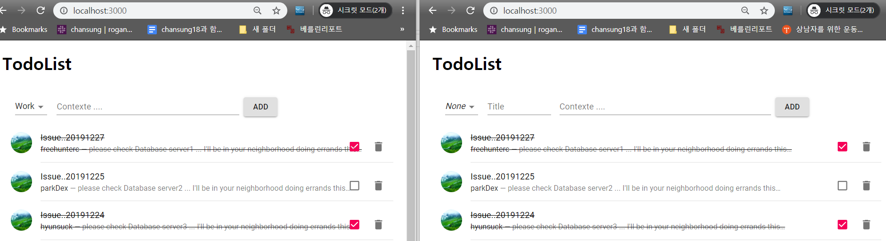
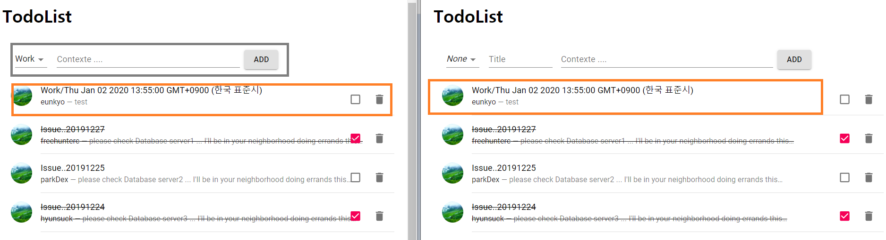
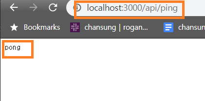

## nextjs + mobx + socket io + koa 사용 예제

Next js 에서 mobx를 이용하여 상태 관리를 하고 socket io를 이용하여 실시간으로 데이터를 주고 받는 예제를 todoList로 만들어 보았습니다. 
In Next js, we used Mobx to manage the state and made the example of sending and receiving data in real time as a todoList.

시작하는 방법: cmd 창에서 "yarn dev" 를 입력시면 됩니다.  
To get started: input "yarn dev" in the cmd.

컴파일이 완료 되면 [http://localhost:3000/](http://localhost:3000/) 해당 주소로 두개의 창을 뛰웁니다. (시크릿 모드)
<br/>

한쪽에 메세지를 추가 해봅니다. 동시에 리스트가 추가 되어지는것을 볼수있습니다.

아래 소스와 같이 Socket io를 통하여 구현하였습니다.
<br/>
Sever
<br/>
```
socket.on('add-todoitem', (data) =>{
	dataList.unshift(data.message);
	socket.broadcast.emit('update-todolist', {
		message :  dataList
	})
});
```
<br/>
Client
<br/>

```
@action  addItem = (item) =>{
	this.TodoList.unshift(item);
	const  socket = Socket('/');
		socket.emit('add-todoitem', {
			message :  item
		}
)};
```


<br/>
아래 사진과 같이 api또한 잘 작동함을 볼수있습니다. 


<br/>
```
api.get('/ping', async  context  => {
	context.body = 'pong';
});
```
<br/>
(*사실 next js 9 가 나오면서 /page/api 경로로 js파일을 만들어도 api를 호출 할수있습니다. [https://nextjs.org/blog/next-9#])
<br/>

